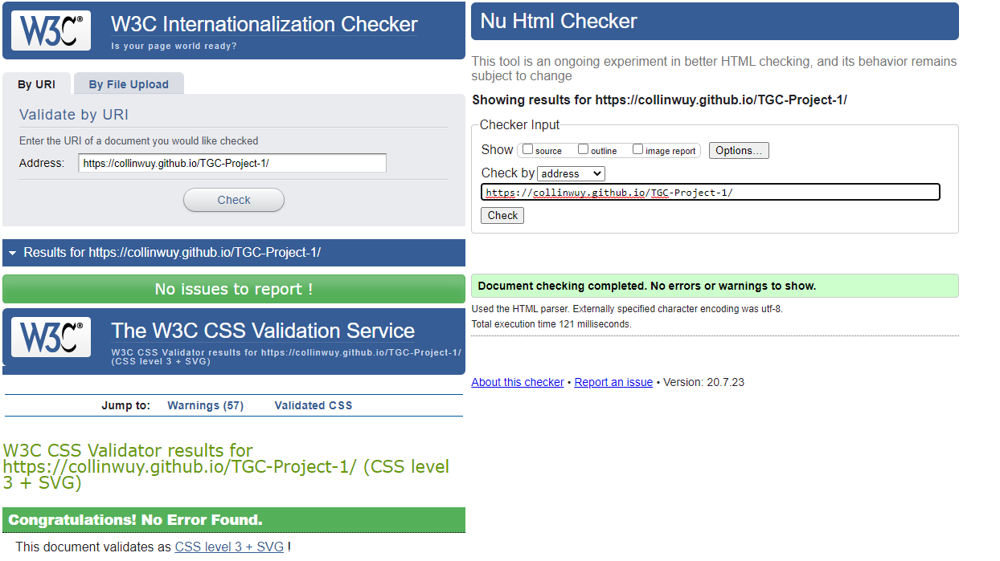

# Functional Integration Center | Feldenkrais Method #

### TGC - User Centric Frontend Development Milestone Project 1 ###
By: **Collin Wu Yuewei** -- *Code Institute Batch 8* -- 

A user-centric portfolio website to promote a movement therapist's skills, knowledge and services. The website has strategic information highlighted to allow the user to make an informed decision to engage the therapist. Using colourful and striking interactive buttons and pop-ups that provide feedback to the user as well as full viewport 5-page single website modern design to remove link loading time resulting in faster response time.

## Aim ##
The goal of the project is to build a static front-end site to present useful information to users, using techonology and languages taught in the Code Institute Fullstack Web Developer Program; at Project 1, namely HTML and CSS.

The concept chosen for this project is Functional Integration Center Website -- *[Feldenkrais-Asia](http://feldenkrais-asia.com/)* -- which is a old wordpress portfilo website that is not mobile responsive (created by me), and upgrade it to a modern mobile responsive website to present information of the movement therapist with information on the techniques and services provided which then can direct potential customers to the therapist. 

## Demo ##

The full website demo can be previewed here: [Functional Integration Center](https://collinwuy.github.io/TGC-Project-1/)

Responsive demo can be previewed here: [Responsive Demo on Various Devices](http://ami.responsivedesign.is/?url=https://collinwuy.github.io/TGC-Project-1/)
 
 

## UX ##

The target audience for this website are for people whom are of the working class and older that are in search of pain-relief or mobility-aid as well as atheletes looking to improve their flexibility and performance.

This project was a mobile first and a single hand operation design in mind. It has to fill the screen and have sufficiently large fonts for pleasant viewing.

The navigation bar is a large sidebar that expands from the left with a collapse button to the bottom left, so that it is easily access via the thumb of the user.

All buttons are purposefully place nearer to the lower left bottom of each page for easy thumb access. Large call to action buttons have color change feedback on press; to quickly gain access to pop-ups with information or relocation to another page down the website.

On larger devices, more fanciful hover animations and color-change is implemented for better user feedback. Most button are now centered for symmmetry. 

The theme of the website is darker, earthy colors with contrasting bright orange and yellow to provide a inviting and theraputic association. 
-- _More Info_ [Color Psychology](https://www.verywellmind.com/color-psychology-2795824) --

The 100% viewport pages design is meant to focus the user's attention on a full screen page and not be distracted by half/cut-off pages; in which can either be scrolled through or brought to with the navbar.

## Features ##
- Full 100% Viewport per page to focus the user's attention
   
- Single Website, All Pages Design for minimal loading of links or other pages 
   
- 100% Offline Website, All Fonts, Icons, Images, Video, JS/CSS Libraries are all downloaded
   
- Custom CSS for scrollbars
   
- Left Side Navbar
  - Icons with Words on Hover for Quick Access
  - Collapsing to a Small Button on the Bottom Left on Mobile Devices
  - Large Left Menu Navbar on Expand for easy thumb access
   
- Homepage  (_Page1_)
  - Video Background to See the      Therapist in Action
  - Animated _Glowing_  Call to Action Button
  - Quick Summary of Website and Service
   
- About (_Page2_)
  - Background Image of Information
  - Overlay with text, condensed information for quick introduction of the basis of the service
   
- Course (_Page3_)
  - Full banner background images to showcase the specific service
  - Accordion buttons that display information of the service on click, maximizing space and keeping the page clean
   
- Trainer (_Page4_)
  - Profile Page of the Therapist
  - Quick Access social network/email/phone buttons 
   
- Contact Form (_Page5_)
  - Simple clean form
  - Pop-up alert feedback on successful or unsuccessful submission

### Features Left to Implement ###

- Form capture and push to email or database (Requires .php)
- Photo Gallery of Activities with Testimonals and Blog
- Converting to BootStrap 4, jQuery, Popper.js (all libraries have been downloaded and included, just not used) 

## Technologies Used ##

* [HTML](https://www.w3schools.com/html/)
    - HTML is universal base language for creating webpages compatible with majority browsers

* [CSS](https://www.w3schools.com/css/)
    - CSS is used for implementing styling to a webpage 

* [JavaScript](https://www.w3schools.com/js/)
    - JavaScript is the programming language of HTML and the Web.
    - Used for accordion pop-up on click
    - Limiting checkbox selection on contact form
    - Verify and validated required fields, and input format in the contact form
    - Pop-up alerts (_SweetAlert2_) on form submission
* [Git](https://git-scm.com/)/[Github](https://github.com/)
    - For version control and commits to Github
* [VSCode IDE](https://code.visualstudio.com/)
    - Local IDE for coding HTML/CSS/JavaScript
    - Extensions used:
      - HTML CSS Support
      - HTML CSS Snippets
      - IntelliSense for CSS
      - JS-CSS-HTML Formatter
      - Live Server (Preview)
      - BootStrap 4, FontAwesome 5 Free
      - Markdown All in One
      - Mardown Preview Enhanced
      - Prettier - Code Formatter

## Testing ##

#### Responsiveness ####
The webpage was manual tested for responsiveness on physical iPhone 6S, Samsung S8+, Xiaomi Mi Max2, 1920 x 1080 laptop screen.

Other devices that are not available physically were tested using this following [Responsiveness Tool](http://responsivetesttool.com/) webpage, [Mobile-Friendly Test](https://search.google.com/test/mobile-friendly?id=07L3WeU_nndVYwaUTleP7w) as well as [Am I Responsive Design](http://ami.responsivedesign.is/?url=https://collinwuy.github.io/TGC-Project-1/)

All platforms had to have correct CSS design, working animation, buttons, pop-up and elements placed in the correct position.

#### Page Load Time ####

The page load time is tested using [Pingdom Tool](https://tools.pingdom.com/) while being hosted by GitHub Pages. This is vital and important as the goal was to have a responsive, non-laggy webpage with no link-loading from page to page, achieving an __A__ rating of __91/100__ points also on Asia, America and European Servers.

#### Code Validation ####

Code validation is achieve by using developer tools provided by [W3C Developer Tools](https://w3c.github.io/developers/tools/). The webpage code tested til no errors are found on their [Nu Html Validator](https://validator.w3.org/nu/?doc=https%3A%2F%2Fcollinwuy.github.io%2FTGC-Project-1%2F), [Internationlization Validator](https://validator.w3.org/i18n-checker/check?uri=https%3A%2F%2Fcollinwuy.github.io%2FTGC-Project-1%2F#validate-by-uri+), [CSS Validator](https://jigsaw.w3.org/css-validator/validator?uri=https%3A%2F%2Fcollinwuy.github.io%2FTGC-Project-1%2F&profile=css3svg&usermedium=all&warning=1&vextwarning=&lang=en), [Link Validator](https://validator.w3.org/checklink?uri=https%3A%2F%2Fcollinwuy.github.io%2FTGC-Project-1%2F&summary=on&hide_type=all&depth=&check=Check).

#### Manual Testing ####

Other testing include:
- Testing of button a tag links, ensuring they jump to the correct part of the page
- Hover animation testing with laptop and mouse overs
- Accordion testing, ensuring pop-up panel happens on click
- Social button's linking to Call on mobile, new page for facebook and re-direct to email with email button
- Contact form testing
  - Error pop-up alert for not having required fields
  - Email format is correct before able to submit
  - Ensuring JavaScript is active, allowing only 1 checkbox to be selected at a time
  - Proper Error Pop-up if form validation has an error
  - Proper Success Pop-up if form submit and validation is successful

#### Browser Testing ####

The site while being hosted by Github Pages is tested on a laptop of 1920x1080 resolution:
- Brave
- Google Chrome
- Firefox
- Microsoft Edge

It is also tested on a iPhone 6S for:
- Safari 

#### Bugs ####

Currently as the mobile responsiveness is accomplished by purely CSS, different vertically of different device viewports causes shifting of the format of the webpage, or having the fonts becoming too small for that viewport. I think this can be resolve if the html is convertered into BootStrap for more unified resizing as compared to media queries.

On certain browsers, like Safari, JavaScript may not function on old versions of Safari and Firefox Browsers have issue reading CSS for checkboxes. However based on [W3School Browser Statics](https://www.w3schools.com/browsers/) in 2020, 80%+ uses Chrome, small number of people uses other browsers.

## Deployment ##

This project uses Git for version control and hosts the repository for all commits. It is linked to my local VSCode IDE. The depolyed site is hosted by Github Pages where it can automatically updated on new commits.

This project can be accessed via [CollinWuY's Github](https://github.com/CollinWuY/TGC-Project-1) where you can clone/download to your computer directly, or immedaitely view the code. 

All the needed assets, images, videos, fonts, icons, javascript, css are in their respective folders, the main site is named index.html, all of which are offline, only links to socials are online.

#### Downloading Locally ####

All files can be easily download on the Github site:
1.  At the top right, click on green button under __CODE__
2.  Select last option: Download .zip

3.  Download the .zip file that can be opened with a ZIP unpacker or RAR unpacker 
4.  Unzip the package
5.  Double click the index.html
    -   it should open on your preferred browser.

#### Linking to Local IDE ####

Cloning this repository can be achieve by using the link provided at the Github site:
1. At the top right, click on green button under __CODE__
2. Copy the link provided: `https://github.com/CollinWuY/TGC-Project-1.git`

3. In your preferred IDE, Run in terminal `git clone https://github.com/CollinWuY/TGC-Project-1.git`
4. Repository will be cloned as a folder on your computer

## Credits ##

#### Media ####

- Background Video and Therapist Images are all Personal Images
- Moshe Feldenkrais Image is taken from [Wikipedia-Moshe Feldenkrais](https://en.wikipedia.org/wiki/Mosh%C3%A9_Feldenkrais)

#### Icons ####

- All icons are downloaded as SVG from [Font Awesome](https://fontawesome.com/)
- Browser Tab Icon is Logo convertered using [Favicon.io](https://favicon.io/favicon-converter/)

#### Code/Concept ####

- Responsive Side Navbar is a modified version of [CodingNepal - Responsive Sidebar Menu using HTML & CSS](https://www.codingnepalweb.com/2020/04/responsive-sidebar-menu-html-css.html)  
- Call to Action button on Homepage is a modified version of [Online Tutorials - Neon Light Animation Effects on Hover | CSS Snake Border](https://www.youtube.com/watch?v=ex7jGbyFgpA)
- Page 3 - Accordion buttons are modified version of Accordion from [W3Schools.com](https://www.w3schools.com/howto/howto_js_accordion.asp)
- Color Palette is generated by [Coolors.co](https://coolors.co/282c34-542331-fa7d64-ffe1a8)
- Pop-up alerts library is downloaded from [Sweet Alert 2](https://sweetalert2.github.io/)

#### Fonts ####

- Fonts are downloaded at [Google Fonts Mallanna](https://fonts.google.com/specimen/Mallanna?query=mallanna) | [Google Fonts Montserrat](https://fonts.google.com/specimen/Montserrat?query=montserra)

#### Unused Libraries for Future Implement ####

- [BootStrap 4.5 CSS and JS](https://getbootstrap.com/docs/4.5/getting-started/download/) 
- [jQuery 3.5.1 JS](https://jquery.com/download/)
- [Popper.js.org](https://cdn.jsdelivr.net/npm/popper.js@1.16.0/dist/umd/popper.min.js)
 

__THIS WEBSITE IS FOR EDUCATIONAL PURPOSE ONLY - ALL RIGHTS RETAIN BY COLLIN WU YUEWEI__